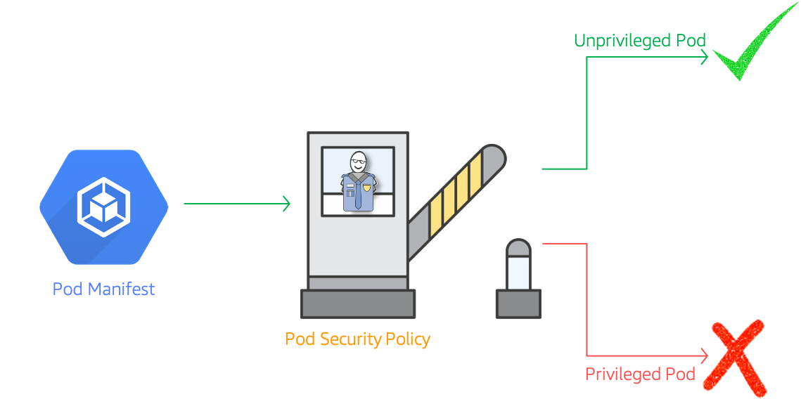

# Kubernetes Pod Security Policy

The developer at Mystique Unicorn are interested in building their application using Kubernetes.They are looking for some help to secure their pods?



## 🎯 Solutions

As part of a defense-in-depth strategy - You have two options to secure your custer

- Pod Security Policy(PSP)<sup>[1]</sup>:
- Pod Security Context<sup>[2]</sup>: Pod level resource

Kubernetes Pod Security Policy are cluster wide resources that control security sensitive attributes of pod specification and are a mechanism to harden the security posture of your Kubernetes workloads. It provides a method to enforce best practices around minimizing container runtime privileges, including not running as the root user, not sharing the host node’s process or network space, not being able to access the host filesystem, enforcing SELinux, and other options. Most cluster workloads will not need special permissions. By forcing containers to use the least-required privilege, their potential for exploitation can be minimized.

As a quick example, using PSPs you can:

- Prevent privileged pods from starting and control privilege escalation.
- Restrict access to the host namespaces, network and filesystem the pod can access.
- Restrict the users/groups a pod can run as.
- Limit the volumes a pod can access.
- Restrict other parameters like runtime profiles or read-only root file systems.

In this article, we’ll show you how to harden your Kubernetes security posture by enabling a simple Pod Security Policy in your EKS environment.

Amazon EKS clusters with Kubernetes version `1.13`<sup>[3]</sup> and higher have a default pod security policy named `eks.privileged`. This policy has no restriction on what kind of pod can be accepted into the system, which is equivalent to running Kubernetes with the _PodSecurityPolicy_ controller disabled.

Without a mechanism to restrict the pod spec privileges, the attacker can do anything the docker command could: running a privileged container, using node resources, etc.

For a quick proof of concept, you can run this script(`stacks/k8s_utils/security_exploits/become_root_on_node.sh`)(**DO NOT RUN THIS ON A PRODUCTION CLUSTER!**).

```sh
# sh ./become_root_on_node.sh
[root@sudo--ip-10-10-1-67 /]# whoami
root
[root@sudo--ip-10-10-1-67 /]# hostname
sudo--ip-10-10-1-67.us-east-2.compute.internal
[root@sudo--ip-10-10-1-67 /]# ls -l /var/log/pods/
total 0
drwxr-xr-x 3 root root 21 Jun 15 10:58 default_miztiik-sudo_f4bf5609-80ce-4e75-8c12-714042dc4f74
drwxr-xr-x 3 root root 21 Jun 14 14:30 default_privileged_6155be2f-0c18-41ad-aaf5-c301f1495326
drwxr-xr-x 3 root root 27 Jun 13 21:03 default_ssm-installer-bk6rf_4adc663c-e22b-448f-bbbc-ab14e15c0a2f
drwxr-xr-x 2 root root  6 Jun 14 14:40 default_test_3aa9c15e-e1b1-4dbe-9774-cff36907d926
drwxr-xr-x 3 root root 34 Jun 15 10:52 kubernetes-dashboard_kubernetes-dashboard-5d9c5bb99d-stc6g_9a7781f1-cf03-4583-a7c8-20efe20c963f
drwxr-xr-x 4 root root 46 Jun 13 21:02 kube-system_aws-node-ccj5z_b3f5beff-5c73-4416-b801-1fd75562db2a
drwxr-xr-x 3 root root 24 Jun 13 21:02 kube-system_kube-proxy-rws4c_5b3f059e-b6e2-4eca-b6ef-8ce81368b71b
```

This is scary and highly undesirable.

## 💡 Pod Security Policy Deprecation?

Having said all the scary stuff, Are PSPs the way to secure you pods now and in the future. The kubernetes community thinks otherwise. PodSecurityPolicy is deprecated<sup>[6],[7]</sup> as of Kubernetes v`1.21`, and will be removed in v`1.25`. If that is being deprecated, what do we need to use to secure our cluster, The community has developed a Kubernetes Enhancement Proposal (KEP 2579) and a prototype for a new feature, currently being called by the temporary name "_PSP Replacement Policy_." It is being targeting for an Alpha release in Kubernetes `1.22`. Until then we can continue using the current PSPs

Let me show a very simple security policy, that will stop anyone from running a privileged pod. You can learn more on pod security best practices here<sup>[9]</sup>. We will use a simple AWS EKS cluster with couple of nodes to setup PSP.

1. ## 🧰 Prerequisites

   This demo, instructions, scripts and cloudformation template is designed to be run in `us-east-1`. With few modifications you can try it out in other regions as well(_Not covered here_).

   - 🛠 AWS CLI Installed & Configured - [Get help here](https://youtu.be/TPyyfmQte0U)
   - 🛠 AWS CDK Installed & Configured - [Get help here](https://www.youtube.com/watch?v=MKwxpszw0Rc)
   - 🛠 Python Packages, _Change the below commands to suit your OS, the following is written for amzn linux 2_
     - Python3 - `yum install -y python3`
     - Python Pip - `yum install -y python-pip`
     - Virtualenv - `pip3 install virtualenv`

1. ## ⚙️ Setting up the environment

   - Get the application code

     ```bash
     git clone https://github.com/miztiik/eks-security-with-psp
     cd eks-security-with-psp
     ```

1. ## 🚀 Prepare the dev environment to run AWS CDK

   We will use `cdk` to make our deployments easier. Lets go ahead and install the necessary components.

   ```bash
   # You should have npm pre-installed
   # If you DONT have cdk installed
   npm install -g aws-cdk

   # Make sure you in root directory
   python3 -m venv .venv
   source .venv/bin/activate
   pip3 install -r requirements.txt
   ```

   The very first time you deploy an AWS CDK app into an environment _(account/region)_, you’ll need to install a `bootstrap stack`, Otherwise just go ahead and deploy using `cdk deploy`.

   ```bash
   cdk bootstrap
   cdk ls
   # Follow on screen prompts
   ```

   You should see an output of the available stacks,

   ```bash
   eks-cluster-vpc-stack
   eks-cluster-stack
   ssm-agent-installer-daemonset-stack
   ```

1. ## 🚀 Deploying the application

   Let us walk through each of the stacks,

   - **Stack: eks-cluster-vpc-stack**
     To host our EKS cluster we need a custom VPC. This stack will build a multi-az VPC with the following attributes,

     - **VPC**:
       - 2-AZ Subnets with Public, Private and Isolated Subnets.
       - 1 NAT GW for internet access from private subnets

     Initiate the deployment with the following command,

     ```bash
     cdk deploy eks-cluster-vpc-stack
     ```

     After successfully deploying the stack, Check the `Outputs` section of the stack.

   - **Stack: eks-cluster-stack**
     As we are starting out a new cluster, we will use most default. No logging is configured or any add-ons. The cluster will have the following attributes,

     - The control pane is launched with public access. _i.e_ the cluster can be access without a bastion host
     - `c_admin` IAM role added to _aws-auth_ configMap to administer the cluster from CLI.
     - One managed EC2 node group created from a launch template
       - It create two `t3.medium` instances running `Amazon Linux 2`
       - Auto-scaling Group with `2` desired instances.
       - The nodes will have a node role attached to them with `AmazonSSMManagedInstanceCore` permissions

     In this demo, let us launch the EKS cluster in a custom VPC using AWS CDK. Initiate the deployment with the following command,

     ```bash
     cdk deploy eks-cluster-stack
     ```

     After successfully deploying the stack, Check the `Outputs` section of the stack. You will find the `*ConfigCommand*` that allows yous to interact with your cluster using `kubectl`

   - **Stack: ssm-agent-installer-daemonset-stack**
     This EKS AMI used in this stack does not include the AWS SSM Agent out of the box. If we ever want to patch or run something remotely on our EKS nodes, this agent is really helpful to automate those tasks. We will deploy a daemonset that will _run exactly once?_ on each node using a cron entry injection that deletes itself after successful execution. If you are interested take a look at the deamonset manifest here `stacks/back_end/eks_cluster_stacks/eks_ssm_daemonset_stack/eks_ssm_daemonset_stack.py`. This is inspired by AWS guidance.

     Initiate the deployment with the following command,

     ```bash
     cdk deploy ssm-agent-installer-daemonset-stack
     ```

     After successfully deploying the stack, You can use connect to the worker nodes instance using SSM Session Manager.

1. ## 🔬 Testing the solution

   We are all set with our cluster to configure a custom pod security policy. _**NOTE:**_ When you delete the default policy, no pods can be created on the cluster, except those that meet the security context in your new namespace.

   1. **Creating Custom Pod Security Policy in Kubernetes**

      We will need the following actions to setup a new PSP

      - Create a new namespace: `miztiik-psp-restrictive`
      - Associate a service account with this namespace `sa-miztiik-dev`
      - Create new PSP `miztiik-secured`
      - Create a cluster role in this namespace
      - Create role binding the role with the service account and namespace
      - Apply new PSP to namespace
      - Delete _old/default_ PSP
      - Try to launch privileged pod

   1. **Create Namespace and Service Account**:

      ```bash
      # Create a new namespace
      kubectl create ns miztiik-psp-restrictive
      # Create Service Account
      kubectl -n miztiik-psp-restrictive create sa sa-miztiik-dev
      # Create a cluster level Role for the service account to use
      kubectl -n miztiik-psp-restrictive create rolebinding miztiik-psp-admin \
             --clusterrole=edit \
             --serviceaccount=miztiik-psp-restrictive:sa-miztiik-dev
      ```

   1. **Create Pod Security Policy**:
      The PSP policy in this directory `stacks/k8s_utils/pod_security_policies/secure_psp_policy.yaml`, save this as `secure_psp_policy.yaml`

      ```
      apiVersion: policy/v1beta1
      kind: PodSecurityPolicy
      metadata:
        name: miztiik-secured
      spec:
        privileged: false # DO NOT ALLOW privileged pods!
        seLinux:
          rule: RunAsAny
        supplementalGroups:
          rule: RunAsAny
        runAsUser:
          rule: RunAsAny
        fsGroup:
          rule: RunAsAny
        volumes:
        - "*"
      ```

      ```bash
      kubectl -n miztiik-psp-restrictive apply -f secure_psp_policy.yaml
      ```

      You can confirm if the policy has been applied correctly,

      ```bash
      kubectl get psp -n miztiik-psp-restrictive
      ```

      Expected Output,

      ```bash
      NAME              PRIV    CAPS   SELINUX    RUNASUSER   FSGROUP    SUPGROUP   READONLYROOTFS   VOLUMES
      miztiik-secured   false          RunAsAny   RunAsAny    RunAsAny   RunAsAny   false            *
      ```

   1. **Create Role & Rolebinding**:

      ```bash
      # Create Role
      kubectl -n miztiik-psp-restrictive create role psp:unprivileged \
        --verb=use \
        --resource=podsecuritypolicy \
        --resource-name=miztiik-secured
      # Create Role Binding
      kubectl -n miztiik-psp-restrictive create rolebinding sa-miztiik-dev:psp:unprivileged \
        --role=psp:unprivileged \
        --serviceaccount=miztiik-psp-restrictive:sa-miztiik-dev
      ```

   1. **Create Privileged Pod**:

      Save the following manifest as `busybox_privileged.yml` and deploy it,

      ```yaml
      apiVersion: v1
      kind: Pod
      metadata:
        name: busybox_privileged
      spec:
        hostNetwork: true
        containers:
          - name: busybox
            image: busybox
            command: ["sh", "-c", "sleep 1h"]
      ```

      ```bash
      kubectl --as=system:serviceaccount:miztiik-psp-restrictive:sa-miztiik-dev \
        -n miztiik-psp-restrictive \
        apply -f busybox_privileged.yml
      ```

      You should be seeing an error like this,

      ```sh
      Error from server (Forbidden): error when creating "busybox_privileged.yml": pods "busybox_privileged" is forbidden: PodSecurityPolicy: unable to admit pod: [spec.securityContext.hostNetwork: Invalid value: true: Host network is not allowed to be used]
      ```

      If you remove the line `hostNetwork: true` or change it to false and redeploy the manifest, for example `busybox.yml`, This manifest will be deployed successfully.

1. ## 📒 Conclusion

   Here we have demonstrated how to use Kubernetes Pod security Policy to scale kubernetes clusters, You can extend this solution to secure your cluster by adding more rules to your policy

1. ## 🧹 CleanUp

   If you want to destroy all the resources created by the stack, Execute the below command to delete the stack, or _you can delete the stack from console as well_

   - Resources created during [Deploying The Application](#-deploying-the-application)
   - Delete CloudWatch Lambda LogGroups
   - _Any other custom resources, you have created for this demo_

   ```bash
   # Delete from cdk
   cdk destroy

   # Follow any on-screen prompts

   # Delete the CF Stack, If you used cloudformation to deploy the stack.
   aws cloudformation delete-stack \
     --stack-name "MiztiikAutomationStack" \
     --region "${AWS_REGION}"
   ```

   This is not an exhaustive list, please carry out other necessary steps as maybe applicable to your needs.

## 📌 Who is using this

This repository aims to show how to use Pod Security Policy to new developers, Solution Architects & Ops Engineers in AWS. Based on that knowledge these Udemy [course #1][102], [course #2][101] helps you build complete architecture in AWS.

### 💡 Help/Suggestions or 🐛 Bugs

Thank you for your interest in contributing to our project. Whether it is a bug report, new feature, correction, or additional documentation or solutions, we greatly value feedback and contributions from our community. [Start here](/issues)

### 👋 Buy me a coffee

[](https://ko-fi.com/Q5Q41QDGK) Buy me a [coffee ☕][900].

### 📚 References

1. [Kubernetes Docs: Pod Security Policies][1]
1. [Kubernetes Docs: Security Context for a Pod][2]
1. [AWS Docs: Amazon EKS default pod security policy][3]
1. [Racher Docs: Pod Security Policies][4]
1. [Racher Docs: Pod Security Policies - Dive Deeper][5]
1. [Kubernetes Docs: Pod Security Policies Deprecation][6]
1. [Kubernetes Docs: Pod Security Policies Deprecation][7]
1. [AWS Blog: Amazon EKS Pod Security Policy][8]
1. [AWS Blog: Amazon EKS Best Practices][9]

### 🏷️ Metadata


**Level**: 300

[1]: https://kubernetes.io/docs/concepts/policy/pod-security-policy/
[2]: https://kubernetes.io/docs/tasks/configure-pod-container/security-context/
[3]: https://docs.aws.amazon.com/eks/latest/userguide/pod-security-policy.html
[4]: https://rancher.com/blog/2020/pod-security-policies-part-1/
[5]: https://rancher.com/blog/2020/pod-security-policies-part-2
[6]: https://kubernetes.io/blog/2021/04/06/podsecuritypolicy-deprecation-past-present-and-future/
[7]: https://kubernetes.io/docs/concepts/policy/pod-security-policy/
[8]: https://aws.amazon.com/blogs/opensource/using-pod-security-policies-amazon-eks-clusters/
[9]: https://aws.github.io/aws-eks-best-practices/security/docs/pods/
[100]: https://www.udemy.com/course/aws-cloud-security/?referralCode=B7F1B6C78B45ADAF77A9
[101]: https://www.udemy.com/course/aws-cloud-security-proactive-way/?referralCode=71DC542AD4481309A441
[102]: https://www.udemy.com/course/aws-cloud-development-kit-from-beginner-to-professional/?referralCode=E15D7FB64E417C547579
[103]: https://www.udemy.com/course/aws-cloudformation-basics?referralCode=93AD3B1530BC871093D6
[899]: https://www.udemy.com/user/n-kumar/
[900]: https://ko-fi.com/miztiik
[901]: https://ko-fi.com/Q5Q41QDGK
